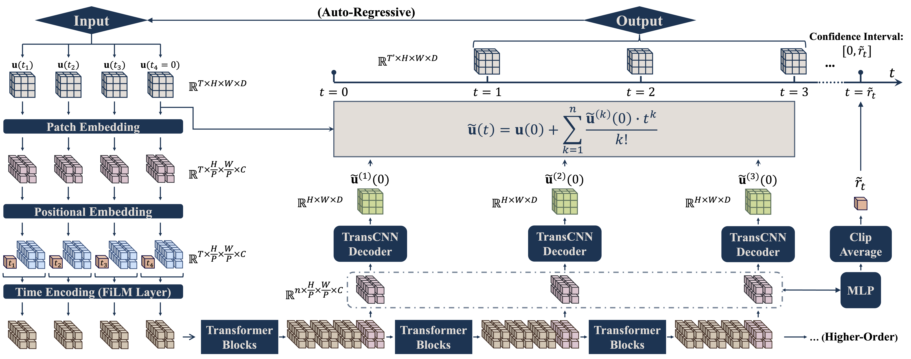
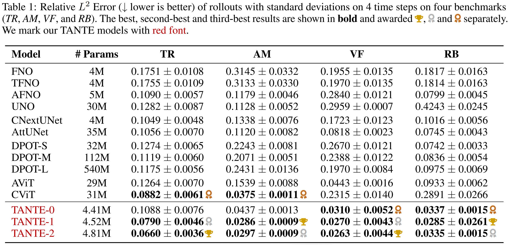

# TANTE: Time-Adaptive Operator Learning via Neural Taylor Expansion

<p align="center">  </p>

> ***TANTE** is a new operator-learning framework for time-dependent PDEs that uses **neural Taylor expansion** to make accurate, **continuous-time** predictions with **adaptive step sizes**, improving both accuracy and efficiency over fixed-step methods.*

---
## 🧱 Pipeline

<p align="center">  </p>

> Time-Adaptive Transformer with Neural Taylor Expansion (TANTE). Our framework enables continuous-time prediction with dynamically adjusted step sizes based on local temporal complexity. TANTE generates forecasts by summing the predicted derivatives as a Taylor series within the confidence interval.


## 📦 Installation
```angular2html
cd TANTE

# (Optional) create conda env
conda create -n tante python=3.11
conda activate tante

pip install -r requirements.txt
```

## 📚 Datasets
Our data is from *The Well* datasets — *Turbulent Radiative Layer*, *Active Matter*, *Viscoelastic Instability*, *Rayleigh–Bénard* — collected by PolymathicAI (https://github.com/PolymathicAI/the_well).
Follow their repo to download raw files, then organise them as:

```angular2html
datasets/
└─ active_matter/
   ├─ active_matter.yaml
   ├─ stats.yaml
   ├─ train/   *.hdf5
   ├─ valid/   *.hdf5
   └─ test/    *.hdf5
```
Then set ```root_path``` in ```configs/<model>.yaml``` accordingly.

## 🚀 Training

```angular2html
# Train from scratch / Resume (same <experiment> name)
python train.py --config-name=<model_name>
```
Logs → ```output/```, Checkpoints → ```experiments/<experiment>/```.

## 🔎 Evaluation
```angular2html
python eval.py --config-name=<model_name>
```

```eval.py``` auto-loads the checkpoint specified by ```experiment``` in the config of ```<model_name>```.

## 🏆 Main Results

<p align="center">  </p>

> *Representative TANTE rollout predictions across four benchmarks.* Each benchmark's results are shown in three rows: the first row displays the ground truth field (reference), the second row shows the predictions from TANTE, and the third row illustrates the point-wise absolute error between the predictions and the ground truth. **Left:** $Buoyancy$ field in the *Rayleigh-Bénard convection (RB)* benchmark across eight time steps. **Top Right** $Velocity$ field (y-direction) in the *Active Matter (AM)* benchmark across sixteen time steps. **Middle Right:** $C_{xx}$ field in the *Viscoelastic Instability fluids (VF)* benchmark across sixteen time steps. **Bottom Right:** $Density$ field in the *Turbulent Radiative Layer (TR)* benchmark across fourteen time steps.


<p align="center">  </p>

> Predictions of the target field at $t=4$ time step on the four benchmarks. For each dataset, we show one representative sample comparing our approach with the best performance against several competitive baselines with top accuracy.

<p align="center">  </p>
