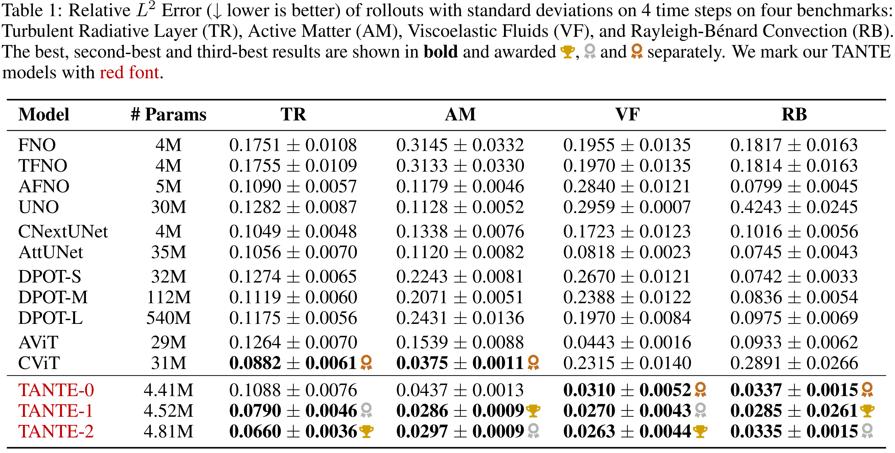

# TANTE: Time-Adaptive Operator Learning via Neural Taylor Expansion

<p align="center">  </p>

> ***TANTE** is a new operator-learning framework for time-dependent PDEs that uses **neural Taylor expansion** to make accurate, **continuous-time** predictions with **adaptive step sizes**, improving both accuracy and efficiency over fixed-step methods.*

---
## 🧱 Pipeline

<p align="center">  </p>

> Time-Adaptive Transformer with Neural Taylor Expansion (TANTE). Our framework enables continuous-time prediction with dynamically adjusted step sizes based on local temporal complexity. TANTE generates forecasts by summing the predicted derivatives as a Taylor series within the confidence interval.


## 📦 Installation
```angular2html
cd TANTE

# (Optional) create conda env
conda create -n tante python=3.11
conda activate tante

pip install -r requirements.txt
```

## 📚 Datasets
We rely on *The Well* datasets — *Turbulent Radiative Layer*, *Active Matter*, *Viscoelastic Instability*, *Rayleigh–Bénard* — collected by PolymathicAI (https://github.com/PolymathicAI/the_well).
Follow their repo to download raw files, then organise them as:

```angular2html
datasets/
└─ active_matter/
   ├─ active_matter.yaml
   ├─ stats.yaml
   ├─ train/   *.hdf5
   ├─ valid/   *.hdf5
   └─ test/    *.hdf5
```
Then set ```root_path``` in ```configs/<model>.yaml``` accordingly.

## 🚀 Training

```angular2html
# Train from scratch / Resume (same <experiment> name)
python train.py --config-name=<model_name>
```
Logs → ```output/```, Checkpoints → ```experiments/<experiment>/```.

## 🔎 Evaluation
```angular2html
python eval.py --config-name=<model_name>
```

```eval.py``` auto-loads the checkpoint specified by ```experiment``` in the config of ```<model_name>```; switch modes in ```eval.py``` to run rollout, error-vs-time curves, or other specific experiments in our paper.

## 🏆 Main Results

<p align="center">  </p>

> L2RE (↓ lower is better) of rollouts on $T'$ time points on four benchmarks (*TR*, *AM*, *VF*, and *RB*). Results are divided into three parts based on different model sizes. In each part, the best results are **bolded** and the second-best results are **underlined**. We **highlight** the globally best results using **blue** and mark our TANTE models with **red font**.
